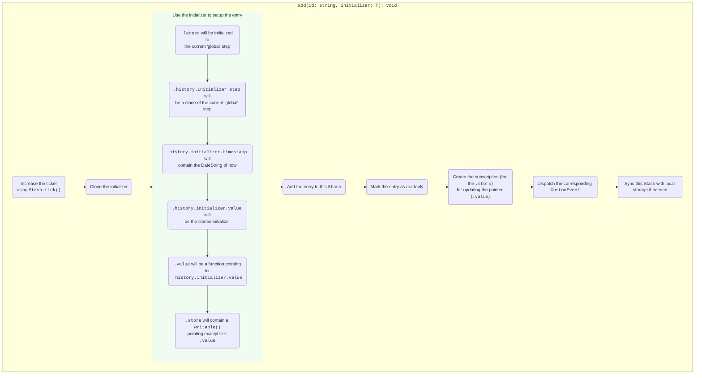

```mermaid
flowchart TD
subgraph add ["<tt>add<T>(id: string, initializer: T): void</tt>"]
	add1("Increase the ticker\nusing <tt>Stash.tick()</tt>") --> add2
	add2("Clone the initializer") --> add3
	subgraph add3 ["Use the initializer to setup the entry"]
	    direction TB
	    add3setup1("<tt>.latest</tt> will be initialized to\nthe current 'global' step") -->    add3setup2
	    add3setup2("<tt>.history.initializer.step</tt> will\nbe a clone of the current 'global' step") --> add3setup3
	    add3setup3("<tt>.history.initializer.timestamp</tt> will\ncontain the DateString of now") --> add3setup4
	    add3setup4("<tt>.history.initializer.value</tt> will\nbe the cloned initializer") --> add3setup5
	    add3setup5("<tt>.value</tt> will be a function pointing\nto <tt>.history.initializer.value</tt>") --> add3setup6
	    add3setup6("<tt>.store</tt> will contain a <tt>writable()</tt>\npointing exactyl like <tt>.value</tt>")
	end
	add3 --> add4
	add4("Add the entry to this <tt>Stash</tt>") --> add5
	add5("Mark the entry as readonly") --> add6
	add6("Create the subscription (for the <tt>.store</tt>)\nfor updating the pointer (<tt>.value</tt>)") --> add7
	add7("Dispatch the corresponding <tt>CustomEvent</tt>") --> add7setup1
	add7setup1("Sync this </tt>Stash</tt> with local storage if needed")
end
%% --- Styling ---
class add3 subGraph1
classDef subGraph1 fill:#f1fcf1,stroke:#afa,stroke-width:1px,color:#151;
```
